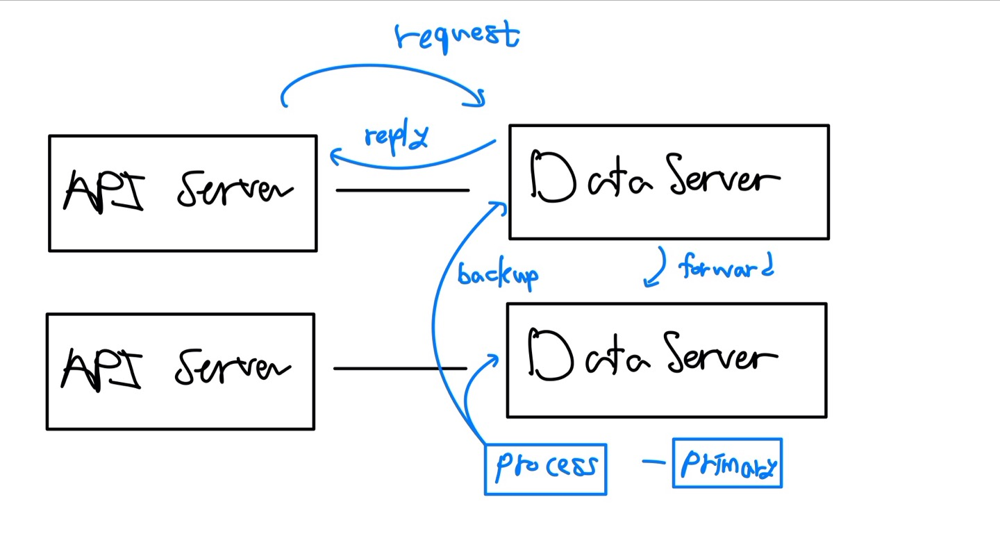
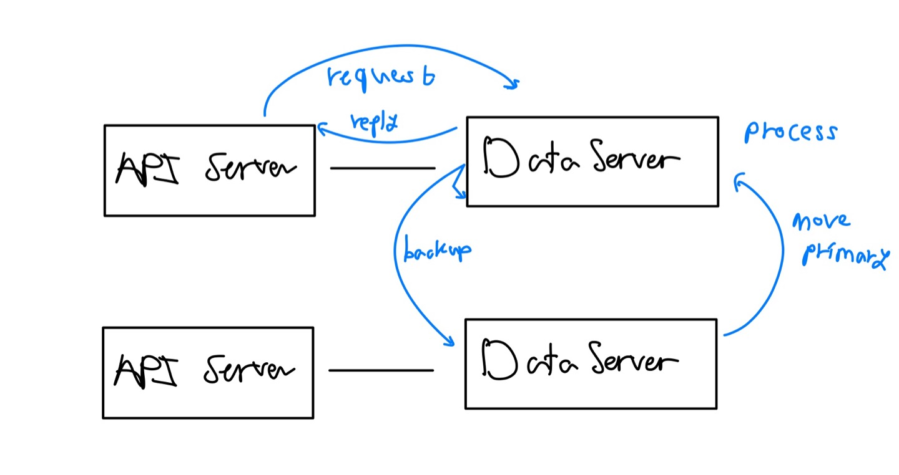

# Simple Distributed System
API 서버와 데이터 서버간의 분산처리를 구현한 결과물입니다. 해당 분산구조는 PRIMARY BASE를 기반으로 진행하였으며 Local Write와 Remote Write를 지원합니다.

## Architecture
API 서버와 데이터베이스간의 2가지의 동기화 메커니즘을 구현하였습니다.  
파일의 구조는 아래와 같습니다. 
```Shell
ㄴ log
    ㄴ log.txt          # 로그파일
ㄴ main.py              # 프로그램 엔트리 포인트 
ㄴ api_server.py        # API 서버
ㄴ db_server.py         # Replica 서버 
ㄴ service.py           # 데이터 저장파일 - Replica 제어
ㄴ config.json          # 설정 파일 
ㄴ const.py             # 상수 관리
```


### primary base - remote write 

고정 Primary를 두고 API Server로부터 오는 모든 데이터는 Primary Server에게 전송하도록 구현하였습니다. Primary는 전송받은 데이터를 처리하고 자신의 Storage에 저장합니다. 그리고 주변 Replica들에게 변경사항을 알립니다.


### primary base - local write 

API Server의 데이터를 받은 Replica는 기존의 Primary로부터 데이터를 이관받고 자신을 Primary로 설정합니다. 그리고 데이터를 처리하고 주변 Replica들에게 변경사항을 알립니다. 즉, Primary가 변동적으로 설정될 수 있도록 구현하였습니다. 

## Dependency 
- Python 3.10 이상
- pip 패키지 관리 도구
```Shell
pip install flask 
pip install requests
pip install json
```

## How to execute
config.json 파일을 편집하여 최대 REPLICA의 갯수 및 포트 설정이 가능합니다.
```python
{
    "service" : 9988, 
    "sync" : "remote-write", 
    "replicas" : [
        "127.0.0.1:10000", 
        "127.0.0.1:20000",
        "127.0.0.1:30000",
        "127.0.0.1:40000"
    ]
}
```

```Shell
git clone https://github.com/txuna/SimpleDistributedSystem.git
cd SimpleDistributedSystem
python3 main.py
```

# Remote Write 
### POST NOTE
```SHELL
[2023-12-10 22:31:46] CLIENT [REQUEST] [POST] /note [{'title': 'Hello world', 'body': 'patch note'}]
[2023-12-10 22:31:46] REPLICA [REQUEST] Forward request to primary
[2023-12-10 22:31:46] REPLICA [REPLY] Forward request to primary
[2023-12-10 22:31:46] REPLICA [REQUEST] Tell backups to update
[2023-12-10 22:31:46] REPLICA [REPLY] Tell backups to update
[2023-12-10 22:31:46] CLIENT [REPLY] [POST] /note [{'res': True}]
```

### PATCH NOTE
```SHELL
[2023-12-10 22:32:16] CLIENT [REQUEST] [PATCH] /note/1 [{'title': 'Hello world123', 'body': 'patch note'}]
[2023-12-10 22:32:16] REPLICA [REQUEST] Forward request to primary
[2023-12-10 22:32:16] REPLICA [REQUEST] Tell backups to update
[2023-12-10 22:32:16] REPLICA [REPLY] Tell backups to update
[2023-12-10 22:32:16] CLIENT [REPLY] [PATCH] /note/1 [{'res': True}]
```

### PUT NOTE
```SHELL
[2023-12-10 22:32:45] CLIENT [REQUEST] [PUT] /note/1 [{'title': 'Hello world123'}]
[2023-12-10 22:32:45] REPLICA [REQUEST] Forward request to primary
[2023-12-10 22:32:45] REPLICA [REQUEST] Tell backups to update
[2023-12-10 22:32:45] REPLICA [REPLY] Tell backups to update
[2023-12-10 22:32:45] CLIENT [REPLY] [PUT] /note/1 [{'res': True}]
```

### DELETE NOTE
```SHELL
[2023-12-10 22:33:29] CLIENT [REQUEST] [DELETE] /note/1 [{}]
[2023-12-10 22:33:29] REPLICA [REQUEST] Forward request to primary
[2023-12-10 22:33:29] REPLICA [REQUEST] Tell backups to update
[2023-12-10 22:33:29] REPLICA [REPLY] Tell backups to update
[2023-12-10 22:33:29] CLIENT [REPLY] [DELETE] /note/1 [{}]
```

### GET ALL NOTE
```SHELL
[2023-12-10 22:33:01] CLIENT [REQUEST] [GET] /note [{}]
[2023-12-10 22:33:01] CLIENT [REPLY] [GET] /note [{}]
```

# Local Write
### POST NOTE
```SHELL
[2023-12-10 22:34:28] CLIENT [REQUEST] [POST] /note [{'title': 'Hello world123', 'body': 'patch note'}]
[2023-12-10 22:34:28] REPLICA [REQUEST] Tell backups to update
[2023-12-10 22:34:28] REPLICA [REPLY] Tell backups to update
[2023-12-10 22:34:28] CLIENT [REPLY] [POST] /note [{'res': True}]
```
### GET SPECIFIC NOTE
```SHELL
[2023-12-10 22:34:43] CLIENT [REQUEST] [GET] /note/1 [{}]
[2023-12-10 22:34:43] CLIENT [REPLY] [GET] /note/1 [{'res': True, 'note': {'title': 'Hello world123', 'body': 'patch note', 'id': 1}
```

### PATCH NOTE
```SHELL
[2023-12-10 22:35:12] CLIENT [REQUEST] [PATCH] /note/1 [{'title': 'Hello world patch!', 'body': 'patch note'}]
[2023-12-10 22:35:12] REPLICA [REQUEST] Move item to new primary
[2023-12-10 22:35:12] REPLICA [REPLY] Move item to new primary
[2023-12-10 22:35:12] REPLICA [REQUEST] Tell backups to update
[2023-12-10 22:35:12] REPLICA [REPLY] Tell backups to update
[2023-12-10 22:35:12] CLIENT [REPLY] [PATCH] /note/1 [{'res': True}]
```

### PUT NOTE
```SHELL
[2023-12-10 22:35:29] CLIENT [REQUEST] [PUT] /note/1 [{'title': 'Hello world patch!'}]
[2023-12-10 22:35:29] REPLICA [REQUEST] Move item to new primary
[2023-12-10 22:35:29] REPLICA [REPLY] Move item to new primary
[2023-12-10 22:35:29] REPLICA [REQUEST] Tell backups to update
[2023-12-10 22:35:29] REPLICA [REPLY] Tell backups to update
[2023-12-10 22:35:29] CLIENT [REPLY] [PUT] /note/1 [{'res': True}]
```

### DELETE NOTE
```SHELL
[2023-12-10 22:36:24] CLIENT [REQUEST] [DELETE] /note/1 [{}]
[2023-12-10 22:36:24] REPLICA [REQUEST] Move item to new primary
[2023-12-10 22:36:24] REPLICA [REPLY] Move item to new primary
[2023-12-10 22:36:24] REPLICA [REQUEST] Tell backups to update
[2023-12-10 22:36:24] REPLICA [REPLY] Tell backups to update
[2023-12-10 22:36:24] CLIENT [REPLY] [DELETE] /note/1 [{}]

```

### GET ALL NOTE
```SHELL
[2023-12-10 22:36:40] CLIENT [REQUEST] [GET] /note [{}]
[2023-12-10 22:36:40] CLIENT [REPLY] [GET] /note [{}]
```

## Performance